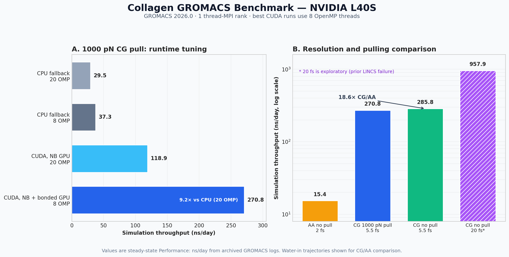

# Collagen GROMACS Benchmark

GPU benchmark and simulation inputs for a collagen microfibril at coarse-grained
(CG) and all-atom (AA) resolution. The benchmarks were run with GROMACS 2026.0
on an NVIDIA L40S and an AMD EPYC 7413 host.



## What was benchmarked

The project contains two related studies:

| Directory | System | Purpose |
|-----------|--------|---------|
| [`cg_constant_pull/`](cg_constant_pull/) | Martini 3 + Go CG, 242,794 particles, 24 groups pulled at 1000 pN | Compare CPU/CUDA and thread/offload configurations |
| [`cg_aa_no_pull/`](cg_aa_no_pull/) | Unforced CG and AA versions of the same microfibril | Compare CG with AA and water-in with water-out trajectory output |

The `.tpr` files are compiled GROMACS run inputs. The `.mdp` files in
`cg_aa_no_pull/` record the no-pull run parameters. Archived `.log` files are
retained as the source for the reported performance numbers; large trajectories
and disposable benchmark outputs were removed.

## Main results

| Benchmark | Configuration | Throughput |
|-----------|---------------|-----------:|
| CG 1000 pN pull, CPU fallback | 1 MPI × 20 OMP | 29.55 ns/day |
| CG 1000 pN pull, CUDA | 1 MPI × 20 OMP, nonbonded on GPU | 118.93 ns/day |
| CG 1000 pN pull, fastest CUDA | 1 MPI × 8 OMP, nonbonded + bonded on GPU | **270.81 ns/day** |
| CG no pull, water in trajectory | fastest CUDA config | **285.77 ns/day** |
| CG no pull, water out of trajectory | fastest CUDA config | **287.24 ns/day** |
| AA no pull, water in trajectory | 1 MPI × 8 OMP, PP + PME on GPU | **15.36 ns/day** |
| AA no pull, water out of trajectory | 1 MPI × 8 OMP, PP + PME on GPU | **16.06 ns/day** |

The fastest pull configuration is about **9.2× faster** than the 20-thread CPU
fallback. For the no-pull system, CG produces about **18.6× more simulated time
per day** than AA. Removing pulling improves CG throughput by about 5.5%.

The 20 fs CG result (957.93 ns/day) is shown separately as experimental: an
earlier run encountered LINCS constraint failures, so it is not a validated
production configuration.

## Recommended configurations

For CG on this host:

```bash
-ntmpi 1 -ntomp 8 -gpu_id 0 -nb gpu -bonded gpu -rdd 3.9
```

For AA:

```bash
-ntmpi 1 -ntomp 8 -rdd 3.9
```

Use the `gromacs-cuda` Conda environment. The installed OpenCL build did not
detect the L40S and therefore ran on CPU.

See the directory documentation for exact commands:

- [`cg_constant_pull/README.md`](cg_constant_pull/README.md)
- [`cg_aa_no_pull/README.md`](cg_aa_no_pull/README.md)

## Running the no-pull benchmarks

```bash
cd /root/collagen_benchmark/cg_aa_no_pull

./run_sim.sh cg       # short CG benchmark, water in xtc
./run_sim.sh cg_now   # short CG benchmark, water out of xtc
./run_sim.sh aa       # short AA benchmark, water in xtc
./run_sim.sh aa_now   # short AA benchmark, water out of xtc
```

For a full production run:

```bash
MODE=production ./run_sim.sh cg
```

`noW` changes only which atoms are written to the compressed trajectory; water
remains present in the simulated system.

## Repository storage note

GitHub rejects individual files larger than 100 MB, and Git LFS quota was not
available when this repository was created. These all-atom inputs therefore
remain local and are ignored by Git:

- `cg_aa_no_pull/aa.tpr`
- `cg_aa_no_pull/aa_noW.tpr`
- `cg_constant_pull/md.tpr`

The smaller CG `.tpr` inputs, MDP files, documentation, scripts, and benchmark
logs are included in the repository.
